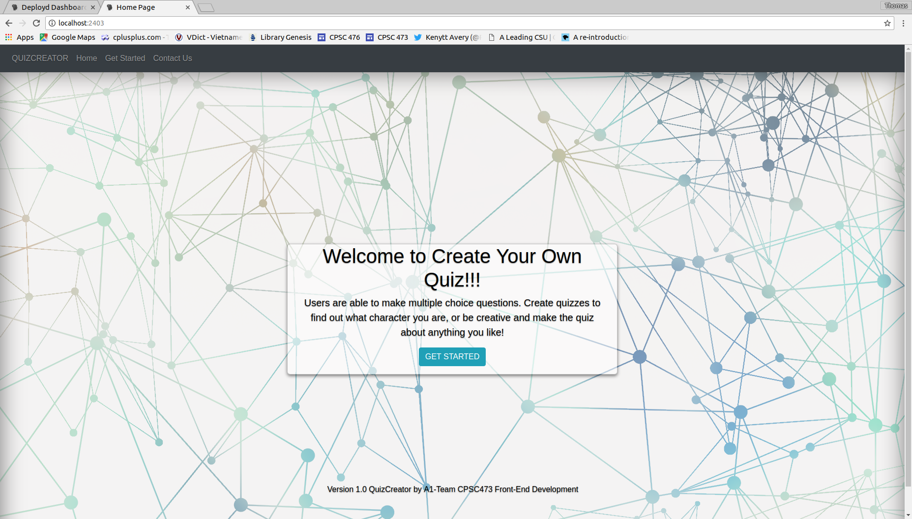
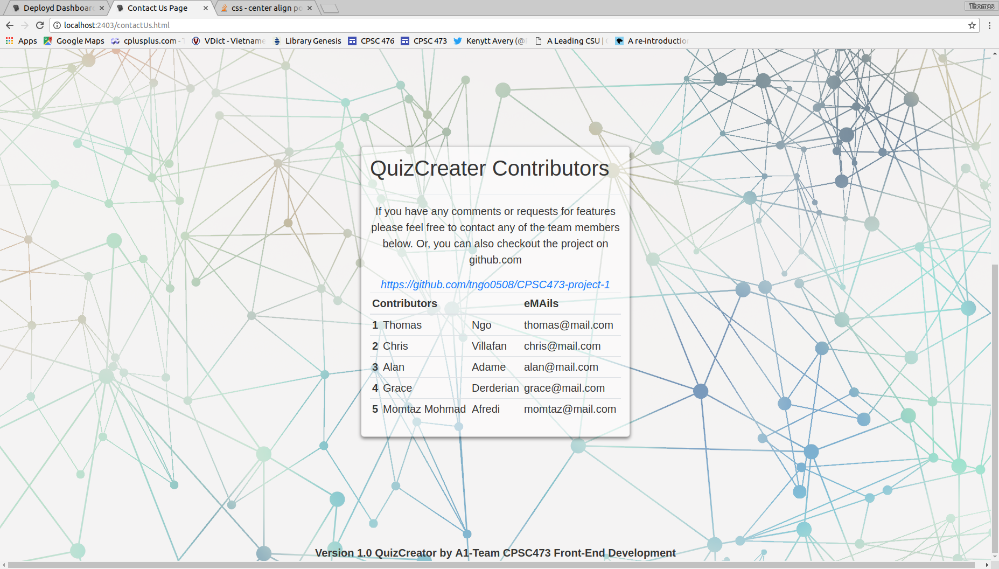
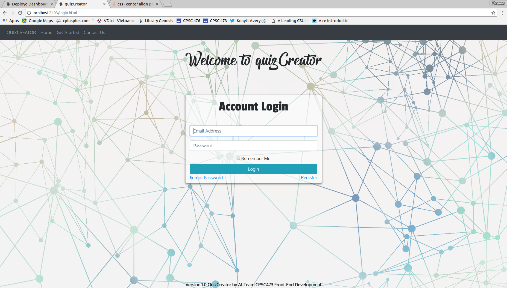
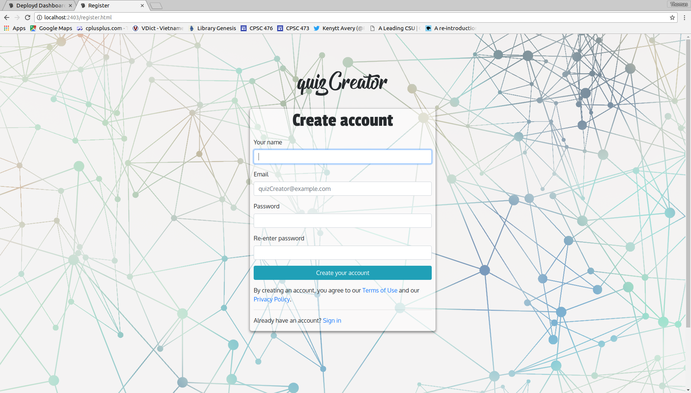
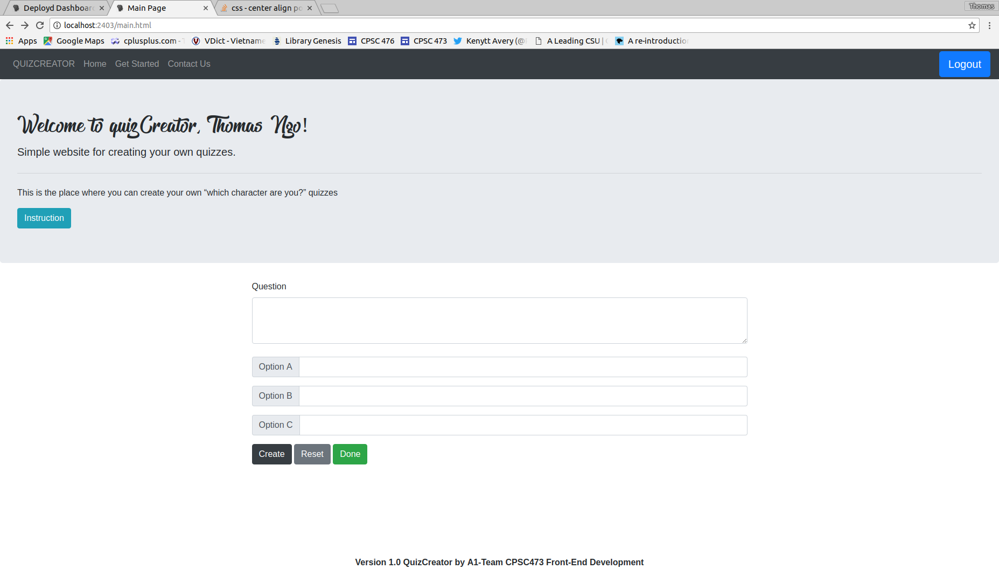
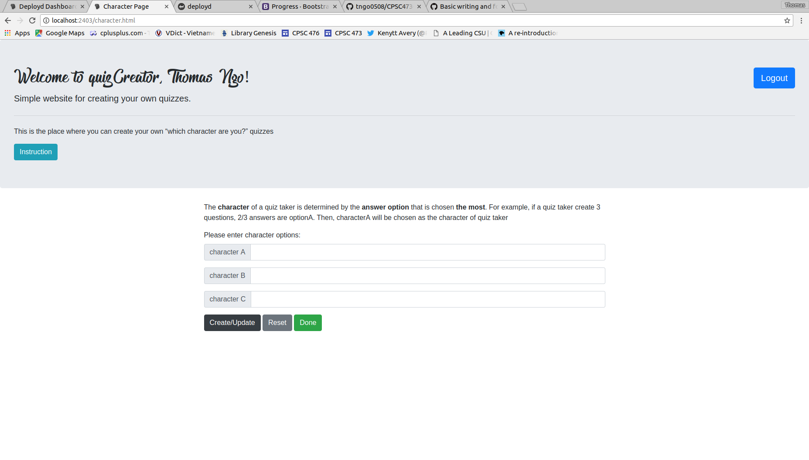

# QuizCreator

-   This application allows users to register or login to their account first. When a user does not have an account, he or she will create one by entering an email address and a password. A user is then asked to login after registering and will be able to create a quiz. When users are done creating a quiz they can create another quiz or allow someone to take the quiz to find out the results after taking the quiz.  
    Creating a quiz works as follows:

    -   Enter the question
    -   Enter up to three possible answers
    -   Enter the correct answer
    -   Continue to create a next question and repeat the process.

-   This application is user-friendly, so anyone can use it. A computer is needed to execute the application locally. This version is local.

-   Upon registering users must include a valid email address. Users will be able to access previously saved data in the Deployd database. Deployd keeps track of the emails, passwords, and quizzes created by the users.

-   This application is a project for a front-end course. We were asked to use client-side JavaScript, Ajax, and Deployd to build one of the applications asked by the professor. The one we selected was, “Visitors can create their own which character are you? Quizzes.”

## Screenshots of QuizCreator

### index.html

### contactUs.html

### login.html

### register.html

### main.html

### character.html

### quiz.html

## Core Technical Concepts/Inspiration

We made this app as a project for a front-end course assignment.
This app will work for anyone who wants to be creative and fun!
With QuizCreator you will be able to access old quizzes and log in to your own account with data stored on an online database. You will also create your own quiz so that you don’t have to go looking for a specific quiz that may not even exist.

## Getting Started/Requirements/Prerequisites/Dependencies

Include any essential instructions for:

-   clone master branch to your local machine
-   use command `dpd create new-project-1` to create your new directory for deployd database
-   copy **public** and **resources** directory to your new-project-1
-   run it by `dpd -d`
-   website should be running on <http://localhost:2403/>

## Built-With

-   [jQuery API](https://api.jquery.com/) - a fast, small, and feature-rich JavaScript library. It makes things like HTML document traversal and manipulation, event handling, animation, and Ajax much simpler with an easy-to-use API that works across a multitude of browsers.

## TODO

-   Enhance UI
-   Fix Minor Bugs
-   Add More Useful Features
    ## Contact
-   grace.derderian@csu.fullerton.edu
-   tngo0508@csu.fullerton.edu
-   aadame4@csu.fullerton.edu
-   cvillanueva19@csu.fullerton.edu
-   mafredi1@csu.fullerton.edu 
    ## License
